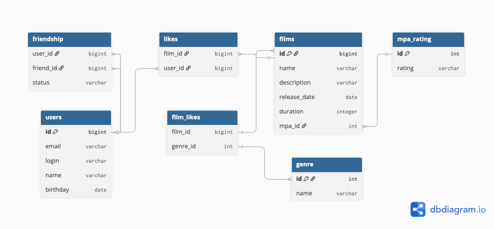

# java-filmorate
# Filmorate

Backend-приложение для работы с фильмами и пользователями.

## ER-диаграмма

Диаграмма базы данных находится в каталоге `docs`.

На диаграмме представлены основные сущности системы:

* пользователи (`users`);
* фильмы (`films`);
* жанры (`genres`);
* рейтинги MPA (`mpa_ratings`);
* лайки пользователей фильмам (`film_likes`);
* дружеские связи между пользователями (`friends`).
